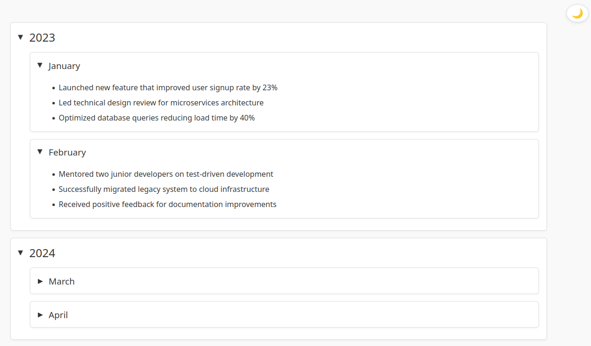
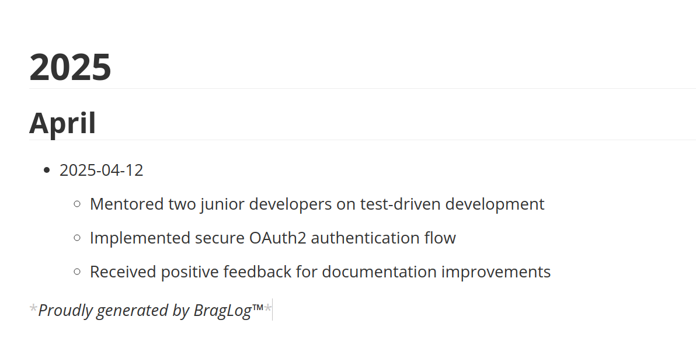

# Exporting
BragLog supports multiple output formats for displaying your achievements.
## Basic
The default format is 'basic', which displays the date followed by your accomplishment:
```shell
> braglog show --format basic
2024-05-14: Launched new feature that improved user signup rate by 23%
2025-03-19: Led technical design review for microservices architecture
2025-03-20: Optimized database queries reducing load time by 40%
2025-03-20: Mentored two junior developers on test-driven development
2025-03-20: Successfully migrated legacy system to cloud infrastructure
2025-03-20: Implemented secure OAuth2 authentication flow
2025-03-21: Received positive feedback for documentation improvements
```
## HTML
BragLog offers a polished HTML format that creates an interactive, modern webpage of your achievements.

To generate and view the HTML report:
```shell
braglog show -f html > output.html
firefox output.html # Or your preferred browser
```

**Tip:** The HTML format is perfect for:

- Performance review preparation
- Portfolio showcasing
- Team achievements tracking
- Weekly/monthly progress reports
## JSON
BragLog provides a structured JSON format perfect for integration with other tools and automated processing.

To generate JSON output:
```shell
braglog show -f json
```
```json
{
  "count": 7,
  "entries": [
    {
      "message": "Led architecture review resulting in successful microservices adoption",
      "date": "2025-03-19"
    },
    {
      "message": "Implemented automated deployment pipeline, cutting release time by 60%",
      "date": "2025-03-29"
    }
    {
      "message": "Delivered tech talk on GraphQL best practices to 50+ engineers",
      "date": "2025-03-29"
    },
    {
      "message": "Resolved critical production issue, preventing K revenue loss",
      "date": "2025-03-29"
    }
  ]
}%
```

## FHTML (Foldable HTML)
BragLog offers a collapsible HTML format that organises your achievements hierarchically by year and month, making it perfect for reviewing longer time periods. It includes a dark mode toggle for comfortable viewing in any environment.

To generate and view the foldable HTML report:
```shell
braglog show -f fhtml > output.html
firefox output.html # Or your preferred browser
```


**Tip:** The FHTML format is perfect for:

- Annual performance reviews
- Visualizing long-term accomplishment patterns

## Markdown
BragLog generates clean, structured Markdown that organises your accomplishments hierarchically by year, month, and day.



To generate and view the Markdown report:
```shell
braglog show -f md > output.md
braglog show -f md | rich - -m
# open in your preferred markdown editor
```
