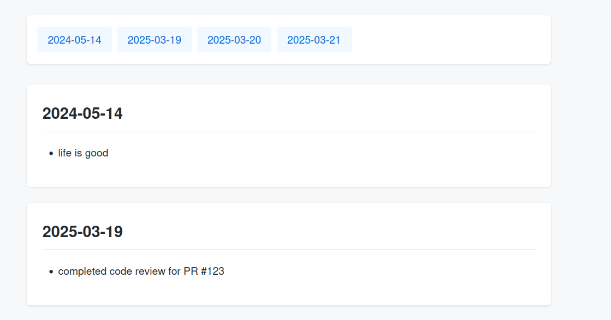

# Exporting
BragLog supports multiple output formats for displaying your achievements.
## Basic
The default format is 'basic', which displays the date followed by your accomplishment:
```shell
> braglog show --format basic
2024-05-14: Launched new feature that improved user signup rate by 23%
2025-03-19: Led technical design review for microservices architecture
2025-03-20: Optimized database queries reducing load time by 40%
2025-03-20: Mentored two junior developers on test-driven development
2025-03-20: Successfully migrated legacy system to cloud infrastructure
2025-03-20: Implemented secure OAuth2 authentication flow
2025-03-21: Received positive feedback for documentation improvements
```
## HTML
BragLog offers a polished HTML format that creates an interactive, modern webpage of your achievements.

To generate and view the HTML report:
```
braglog show -f html > output.html
firefox output.html # Or your preferred browser
```

**Tip:** The HTML format is perfect for:

- Performance review preparation
- Portfolio showcasing
- Team achievements tracking
- Weekly/monthly progress reports
